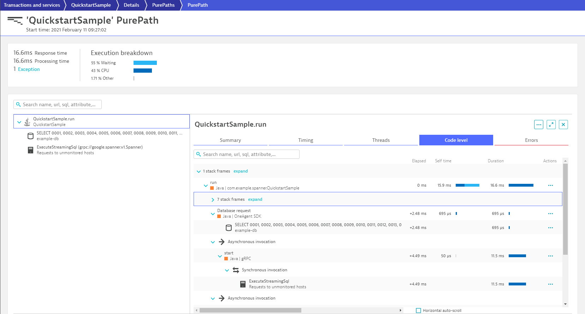

# sdk-google-cloud-spanner

This project provides the necessary groundwork for integrating the [Dynatrace OneAgent SDK[(https://www.dynatrace.com/support/help/extend-dynatrace/oneagent-sdk/) into applications using [Google Cloud Spanner](https://cloud.google.com/spanner) as their database backend.

The current version of the Cloud Spanner Client Libraries for Java provided by Google already ARE preinstrumented with tracing capabilities. Unfortunately they are using [OpenCensus[(https://opencensus.io) - which has officially gotten merged with [OpenTracing](https://opentracing.io) to the [OpenTelemetry Standard](https://opentelemetry.io). Dynatrace OneAgent supports out of the box OpenTelemetry (and to a certain extent also OpenTracing), but support for OpenCensus is unlikely to happen.

It is expected that the Cloud Spanner Libraries for Java will eventually be utilizing OpenTelemetry, but until then applications monitored by OneAgent by default won't be able to recognize requests to Cloud Spanner as Database Queries.
This project therefore represents an intermediate solution - essentially leveraging the OneAgent SDK for Java.

The current implementation focuses the execution of plain queries and updates. But this is by no means feature complete. You're welcome to extend the capabilities in order to trace more complex functionality.

## Usage
This solution will until further notice not be available as prebuilt binaries on public repositories. Therefore it is required to build the solution manually and add the resulting JAR file to a local repository.

Integrating into the build process via Mavan `pom.xml` is pretty straightforward.

```xml
<dependency>
  <groupId>com.dynatrace</groupId>
  <artifactId>sdk-google-cloud-spanner</artifactId>
  <version>3.3.2</version>
</dependency>
```
### Enabling the tracing capabilities
In order to enable the tracing capabilities, let's take a look at a small example.

```java
import com.google.cloud.spanner.DatabaseClient;
import com.google.cloud.spanner.DatabaseId;
import com.google.cloud.spanner.ReadContext;
import com.google.cloud.spanner.ResultSet;
import com.google.cloud.spanner.Spanner;
import com.google.cloud.spanner.SpannerOptions;
import com.google.cloud.spanner.Statement;

...

try (Spanner spanner = options.getService()) {
  DatabaseClient dbClient = spanner.getDatabaseClient(DatabaseId.of(PROJECT_ID, INSTANCE_ID, DATABASE_ID));

  // Queries the database
  ReadContext ctx = dbClient.singleUse();		
  ResultSet resultSet = ctx.executeQuery(Statement.of(SQL));

  // Print out results
  ...

}
```

The only change that is required is to change the line ```try (Spanner spanner = options.getService()) {``` to ```try (Spanner spanner = Tracing.of(options.getService())) {```. Here again the full source code of the sample.

```java
import com.google.cloud.spanner.DatabaseClient;
import com.google.cloud.spanner.DatabaseId;
import com.google.cloud.spanner.ReadContext;
import com.google.cloud.spanner.ResultSet;
import com.google.cloud.spanner.Spanner;
import com.google.cloud.spanner.SpannerOptions;
import com.google.cloud.spanner.Statement;

import dynatrace.com.google.cloud.spanner.Tracing;

...

try (Spanner spanner = Tracing.of(options.getService())) {
  DatabaseClient dbClient = spanner.getDatabaseClient(DatabaseId.of(PROJECT_ID, INSTANCE_ID, DATABASE_ID));

  // Queries the database
  ReadContext ctx = dbClient.singleUse();		
  ResultSet resultSet = ctx.executeQuery(Statement.of(SQL));

  // Print out results
  ...

}
```

The PurePaths created by this sample then look like this.



## Extending the solution
As already mentioned, this solution is by no means feature complete. Currently only plain queries and updates are getting instrumented.
You may want to take a look at the implementation of [ReadContextImpl.java](./src/main/java/dynatrace/com/google/cloud/spanner/ReadContextImpl.java) in order to e.g. extend the capabilities in other places. For almost all use cases decorator classes already exist.
You may wa
